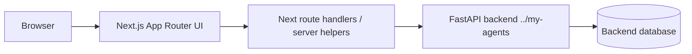

<!-- BEGIN:nextjs-agent-rules -->
# This is NOT the Next.js you know

This version has breaking changes — APIs, conventions, and file structure may all differ from your training data. Read the relevant guide in `node_modules/next/dist/docs/` before writing any code. Heed deprecation notices.
<!-- END:nextjs-agent-rules -->

# AGENTS.md — `my-agents-frontend`

This repository is the frontend companion for the backend-only `my-agents` FastAPI + LangGraph service in `../my-agents`.

The product is a polished AI chat service UI: authenticated users manage conversations, documents, citations, and visible agent activity events backed by the FastAPI API. Keep this repo focused on frontend code and frontend-facing integration only.

## Product intent

- Build a polished frontend for the `my-agents` backend without moving backend logic into the UI repo.
- Demonstrate a real AI product surface: login, conversations, server-owned transcripts, run history, citations, document/knowledge workflows, and redacted agent activity timelines.
- Keep the UI credible for product review: accessible, testable, responsive, and honest about implemented backend capabilities.

## Current stack

- Next.js `16.x` App Router.
- React `19.x`.
- TypeScript.
- Tailwind CSS `4.x`.
- shadcn/Base UI-style local components and utilities.
- TanStack Query for client-side server state.
- React Hook Form + Zod for forms and validation.
- Biome for lint/format.
- Vitest for unit/component tests.
- Playwright for end-to-end/browser checks.
- Package manager: `pnpm`.

## Repository boundary

- Frontend code belongs here.
- Backend code belongs in `../my-agents`.
- Do **not** add FastAPI, Python, Alembic, SQLAlchemy, or backend migration code here.
- Do **not** add another LLM provider integration in this repo.
- Do **not** commit real secrets or local `.env*` files.
- Treat backend API contracts as external service contracts.
- Frontend work may inspect `../my-agents` for context and behavior, but must not modify backend files from this repo unless the user explicitly approves backend work.
- Do not generate or update frontend API models from backend source-file inspection. For API contracts, use the backend's hosted OpenAPI document as the source of truth.
- If a backend route or behavior is missing, first record the needed contract in `docs/backend-requests.md` and report it to the user. Do not silently patch the backend from a frontend task.

## Backend collaboration workflow

This frontend repository may use `../my-agents` as read-only implementation context, but not as the source of truth for generated frontend API contracts. The source of truth for API models is the backend's hosted OpenAPI document.

Rules for future agents working from this frontend repo:

- You may inspect backend files in `../my-agents` to understand implementation behavior, but do not derive or generate frontend request/response models from source inspection.
- Before creating or changing frontend API models, ask the user to host the backend OpenAPI server and provide the OpenAPI URL, normally `http://localhost:8000/openapi.json` or a docs URL such as `http://localhost:8000/docs`.
- If the user already provided an OpenAPI URL in the current task, use that URL directly. Otherwise, stop API model generation and ask for the hosted OpenAPI URL instead of guessing from backend source.
- You must not edit, format, commit, or push backend files from a frontend task.
- If a frontend task exposes a backend gap, record it in `docs/backend-requests.md` and report it to the user before any backend implementation is attempted.
- Backend changes require an explicit user instruction that switches scope to the backend project.
- Keep frontend code resilient to documented backend gaps with honest loading, empty, disabled, or TODO states rather than inventing fake backend behavior.

## Backend API contract this UI targets

The backend is expected to run separately, normally at `http://127.0.0.1:8000` during local development.

Important backend routes currently discussed/implemented:

| Area | Backend routes |
| --- | --- |
| Health | `GET /health` |
| Auth | `POST /auth/signup`, `POST /auth/login`, `POST /auth/logout`, `GET /auth/me` |
| Conversations | `POST /conversations`, `GET /conversations`, `GET /conversations/{conversation_id}` |
| Transcripts | `POST /conversations/{conversation_id}/messages`, `GET /conversations/{conversation_id}/messages` |
| Runs | `POST /conversations/{conversation_id}/runs`, `GET /conversations/{conversation_id}/runs` |
| Run events | `GET /conversations/{conversation_id}/runs/{run_id}/events` |
| Groups | `POST /groups`, `GET /groups`, member management routes |
| Documents | `POST /documents`, `GET /documents`, `GET /documents/{document_id}`, permission patching, ingestion, extraction runs |
| Knowledge bases | knowledge-base create/list/detail routes |
| Legacy dev chat | `POST /assistant/chat` only for smoke/dev; do not use as product chat |

Product chat UI must use conversation/run endpoints, not `/assistant/chat`.

## Preferred frontend architecture

Use a small Next.js BFF/proxy layer for backend calls that need cookies, CSRF, or same-origin behavior.



Recommended shape:

- `app/` — routes, layouts, loading/error UI, route handlers.
- `components/` — reusable UI components; keep generic UI under `components/ui/`.
- `features/<domain>/` — feature-specific components/hooks for auth, conversations, documents, activity events.
- `lib/api/` — typed API client, fetch helpers, request/response types, CSRF/cookie handling.
- `lib/query/` — TanStack Query keys and provider setup.
- `lib/validation/` — Zod schemas shared by forms and API boundary helpers.
- `tests/` or co-located `*.test.ts(x)` — Vitest tests.
- `e2e/` — Playwright tests.

## Agent instruction docs

Read the relevant repo-local guide before modifying code in that area:

- `docs/next-component-boundaries.md` for Server Component / Client Component boundary decisions.
- `docs/server-fetch-policy.md` for server-side fetch freshness, caching, cookies, CSRF, and BFF policy.
- `docs/mobile-responsiveness.md` for responsive route/screen/overlay changes.
- `DESIGN.md` for visual language, layout architecture, component states, accessibility, and responsive behavior.
- `docs/korean-copy-guide.md` before editing any user-facing string. Korean is this product's primary language, not a translation: it owns the glossary, register rules, anti-patterns, and canonical action labels.
- `docs/frontend-architecture.md` for feature folders, routes, endpoint coverage, and integration shape.
- `docs/security-and-backend-boundary.md` for frontend/backend scope and safe auth/session handling.
- `docs/verification-runbook.md` for validation commands and evidence expectations.
- `docs/durable-interactions.md` before touching `components/chat/interactions/`, `components/chat/run-state.ts`, or `model/my-agents/interactions.ts`.

## Durable interaction invariants

A run can suspend mid-answer to ask the user something and resume when answered.
Four rules hold whenever that is true. Breaking any one of them strands a
conversation for up to 24 hours, the server-side expiry default.

- **An unrenderable interaction still renders.** The interaction union is open,
  and unknown types and versions fall back to a card that can still cancel. A
  suspended run blocks every further message, so a card that fails to appear
  leaves the user with a composer that silently refuses to send.
- **Type and version are one support decision.** The card, the registry, and the
  submit handler all gate on `isDocumentSelection`. Checking `type` alone lets a
  future version be answered over the current contract.
- **Blocking and stopping are different questions.** A suspended run blocks new
  runs but produces no output, so it must not offer a stop control, and the
  queue pauses rather than drains. Derive all three from `run-state.ts`.
- **Server truth outlives the stream.** A pending question must be rebuilt from
  the run list on a cold load, and must not be cleared optimistically before a
  cancel succeeds.
- **Options are the backend's list, never assembled here.** Clarification offers
  only user-selectable personal and group documents; system knowledge stays
  ambient and never appears as a choice. The frontend renders the options it is
  given and adds nothing — do not merge in a local document list, infer a
  source, or filter the list client-side. The server also rejects a forged
  selection, so client-side filtering would be a false reassurance on top of the
  real check.

Read `docs/durable-interactions.md` for the reasoning and the two distinct
`run_interrupted` contracts before changing any of this.

## UI behavior priorities

Build in this order unless the user requests otherwise:

1. App shell and auth-aware routing.
2. Signup/login/logout and `/auth/me` session restore.
3. Conversation list and conversation detail.
4. Server-owned transcript display via `GET /conversations/{id}/messages`.
5. Send message via `POST /conversations/{id}/runs`.
6. Run history via `GET /conversations/{id}/runs`.
7. Agent activity timeline via `GET /conversations/{id}/runs/{run_id}/events`.
8. Citation panel from run responses.
9. Document create/list/detail/ingest flows.
10. Group and permission management.

## Auth and security rules

- Prefer HttpOnly cookie session behavior owned by the backend.
- Do not store session tokens, CSRF tokens, raw passwords, or backend secrets in localStorage.
- Use `credentials: "include"` when browser-to-backend or proxy-to-backend cookie flows require it.
- For mutating authenticated requests, preserve the backend CSRF contract. If using a Next route handler proxy, keep CSRF handling centralized there.
- Never display raw provider errors, stack traces, session IDs, CSRF tokens, or hidden chain-of-thought.
- Failed conversation runs should show safe status/error copy from backend redacted events, not raw thrown errors.

## Data fetching rules

- Use typed request/response helpers; do not scatter hard-coded `fetch` calls through components.
- Use TanStack Query for client-visible server state: current user, conversations, messages, runs, events, documents.
- Keep query keys stable and colocated in feature/api modules.
- Use optimistic updates sparingly; prefer correctness for auth and chat history.
- Treat the hosted OpenAPI response models as source of truth. If the UI needs a field that is missing, add an explicit TODO or backend contract note rather than inventing fake data.
- Follow `docs/server-fetch-policy.md` for server-side reads. Auth/session, CSRF/cookie, group membership, document/source permission, and other authorization-sensitive reads should stay fresh per request unless the task explicitly accepts staleness.
- Do not add `cache: "force-cache"` or `next: { revalidate: ... }` to authorization-sensitive reads by default. Use broader caching only for stable non-sensitive data with a clear invalidation path.

## Design and accessibility rules

- Read `DESIGN.md` before UI/theme/layout work; treat it as the active design contract for visual language, component states, accessibility, responsive behavior, and content voice.
- Read `docs/mobile-responsiveness.md` before route/screen/overlay responsive work. Preserve working desktop layouts and add route-local mobile branches only where needed.
- Apply the repo-local `responsive-design` skill for UI/layout work: start mobile-first, prefer fluid typography/spacing tokens, use container-query-ready component wrappers for reusable panels, prevent horizontal overflow, and keep touch targets comfortable before adding desktop-only refinements.
- Apply `.agents/skills/wire-dialog-sheet-ui/SKILL.md` before adding or changing Dialog, Sheet, or Drawer overlays; keep overlays extracted, accessible, and scoped to the smallest Client Component boundary that needs interactivity.
- If requested UI conflicts with `DESIGN.md`, update `DESIGN.md` or add an open question before implementing the exception.
- Build accessible, keyboard-navigable UI by default.
- Prefer simple, readable layouts over decorative AI-dashboard noise.
- Korean and English text should be legible; avoid tiny body text. Use at least comfortable default body sizing unless a component has a clear accessibility reason.
- Follow `docs/korean-copy-guide.md` for all Korean copy. Never rename a Korean noun with a plain find-and-replace: particles agree with the previous syllable's final consonant, and a rename silently corrupts them.
- Keep loading, empty, error, and unauthorized states explicit.
- Agent activity events must be visible as redacted operational steps, not hidden chain-of-thought.
- Citations should be visually tied to the answer and source document/chunk snippet.

## Next.js 16 rules

Before changing routing, server actions, route handlers, caching, cookies, or data-fetching behavior:

1. Read the relevant local docs under `node_modules/next/dist/docs/01-app/`.
2. Prefer App Router conventions.
3. Read `docs/next-component-boundaries.md`.
4. Prefer Server Components by default.
5. Apply `"use client"` only to the deepest component that actually needs client-only hooks, browser event handlers, Base UI/shadcn interactivity, TanStack Query, `useLocalization()`, auth hooks, or local/client context.
6. Do not make route pages, route layouts, tab shells, or broad screen wrappers client components just because one child needs interactivity; extract a leaf client component instead.
7. Prefer URL/route state and server-rendered `Link` navigation over client-state tabs when the tab or selected resource represents navigable content.
8. Opt into route-global/client-global state only when the coordination benefit clearly outweighs the server-rendering, bundle, hydration, and flicker costs.
9. Do not rely on stale Next.js Pages Router patterns unless intentionally adding Pages Router code, which should be avoided here.

## Styling/component rules

- Use Tailwind CSS v4 conventions already configured in the repo.
- Reuse shadcn/Base UI primitives and `lib/utils.ts` before adding new UI abstractions.
- Keep components small and purpose-named.
- Avoid copy-pasting large generated component trees; extract clear feature components.

### Adding UI/UX libraries

Effective 2026-09-05, replacing the 2026-09-02 blanket pre-approval: agents are
encouraged to research and propose useful packages, but must request direct,
explicit approval from the user before installation and wait for their answer.
This applies to runtime and development packages, including trial installations
and package-executing tools such as `pnpm dlx` or `npx` that download a new package.
A general feature request or another agent's recommendation is not installation
approval. Approval already given for the named package and scope need not be asked again.

Before asking, name the package and proposed version, explain why it is useful,
and briefly state alternatives, license, and dependency/bundle impact. Read-only
research may proceed without approval. Restoring dependencies already declared in
the lockfile and running installed project tools do not require new-package approval.

The recommendation still needs justification; a library merely existing is not
enough. A dependency should earn a place that hand-written code cannot fill as well:

- **It carries real complexity.** Virtualization, drag reordering, date/number
  parsing across locales, rich text, charting, and animation choreography are
  bodies of work where a good library is obviously right. A pointer handler, a
  disclosure, or a formatter usually is not.
- **It composes with what is already here.** Tailwind v4, Base UI, and the
  `components/ui/` wrapper convention. A library that wants to own an element
  the repo already owns, ship its own design tokens, or inject markup that
  duplicates an existing control is a poor fit even when it is well built.
- **It is maintained and safely licensed.** Check recent releases, open issue
  volume, install size, transitive dependency count, and the license.
- **It does not fragment the design system.** One general-purpose component
  library remains the goal. Adding a focused single-purpose package alongside
  Base UI is fine; adding a second full component kit is a decision to raise
  with the user for its design impact as well as installation approval, because
  it changes the visual contract `DESIGN.md` holds.

Record the decision in `docs/implementation-log.md`: what was chosen, what was
rejected, and why. If a library was considered and hand-written code won, say
that too — it stops the next agent re-running the same survey.

Keep the existing wrapper rule regardless of origin: feature code imports from
`components/ui/`, never from a vendor package directly, so a swap stays a
one-file change.

## Testing and verification commands

Run before claiming completion after code changes:

```bash
pnpm lint
pnpm exec tsc --noEmit
pnpm exec vitest run
pnpm exec playwright test
pnpm build
```

If Playwright is not installed/configured yet, either add the minimal config when the task needs browser coverage or report it as not configured. For smaller changes, at minimum run:

```bash
pnpm lint
pnpm exec tsc --noEmit
pnpm build
```

After significant visual/UI changes, run the dev server and inspect the relevant page in a browser when possible.

## Local development expectations

Typical local setup:

```bash
pnpm install
pnpm dev
```

Expected environment variables should be safe placeholders only, for example:

```bash
NEXT_PUBLIC_APP_NAME=my-agents
MY_AGENTS_BACKEND_URL=http://127.0.0.1:8000
```

Do not expose secrets through `NEXT_PUBLIC_*`. Anything prefixed `NEXT_PUBLIC_` is browser-visible.

## Documentation expectations

- Update `README.md` when setup commands, environment variables, routes, or user-facing behavior change.
- Add short architecture notes under a docs folder if frontend/backend integration becomes non-obvious.
- Maintain `docs/implementation-log.md` during substantial frontend work so future manual work can follow the sequence, rationale, verification evidence, and remaining risks.
- Maintain `docs/backend-requests.md` for frontend-discovered backend contract gaps.
- Keep `docs/agent-onboarding.md`, `docs/frontend-architecture.md`, `docs/security-and-backend-boundary.md`, and `docs/verification-runbook.md` current when architecture, security, setup, or verification workflow changes.
- Use Mermaid diagrams when they clarify routing, auth/session flow, or chat/run state transitions.
- Keep docs honest: do not claim streaming, OAuth, production deployment, or advanced document upload until implemented and tested.

## Completion criteria

A frontend change is complete only when:

- requested UI or integration behavior is implemented;
- TypeScript, lint, and relevant tests/build pass;
- auth/session and CSRF-sensitive behavior do not leak secrets;
- backend contracts are used honestly;
- README/docs are updated if setup or user-facing behavior changed;
- no backend code or frontend scope violation was added accidentally.
