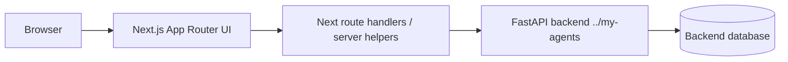

<!-- BEGIN:nextjs-agent-rules -->
# This is NOT the Next.js you know

This version has breaking changes — APIs, conventions, and file structure may all differ from your training data. Read the relevant guide in `node_modules/next/dist/docs/` before writing any code. Heed deprecation notices.
<!-- END:nextjs-agent-rules -->

# AGENTS.md — `my-agents-frontend`

This repository is the frontend companion for the backend-only `my-agents` FastAPI + LangGraph service in `../my-agents`.

The product is a portfolio-grade AI chat service UI: authenticated users manage conversations, documents, citations, and visible agent activity events backed by the FastAPI API. Keep this repo focused on frontend code and frontend-facing integration only.

## Product intent

- Build a polished frontend for the `my-agents` backend without moving backend logic into the UI repo.
- Demonstrate a real AI product surface: login, conversations, server-owned transcripts, run history, citations, document/knowledge workflows, and redacted agent activity timelines.
- Keep the UI credible for portfolio/interview review: accessible, testable, responsive, and honest about implemented backend capabilities.

## Current stack

- Next.js `16.x` App Router.
- React `19.x`.
- TypeScript.
- Tailwind CSS `4.x`.
- shadcn/Base UI-style local components and utilities.
- TanStack Query for client-side server state.
- React Hook Form + Zod for forms and validation.
- Biome for lint/format.
- Vitest for unit/component tests.
- Playwright for end-to-end/browser checks.
- Package manager: `pnpm`.

## Repository boundary

- Frontend code belongs here.
- Backend code belongs in `../my-agents`.
- Do **not** add FastAPI, Python, Alembic, SQLAlchemy, or backend migration code here.
- Do **not** add another LLM provider integration in this repo.
- Do **not** commit real secrets or local `.env*` files.
- Treat backend API contracts as external service contracts. If a backend route is missing, document the needed contract or implement it in `../my-agents` only when explicitly working there.

## Backend API contract this UI targets

The backend is expected to run separately, normally at `http://127.0.0.1:8000` during local development.

Important backend routes currently discussed/implemented:

| Area | Backend routes |
| --- | --- |
| Health | `GET /health` |
| Auth | `POST /auth/signup`, `POST /auth/login`, `POST /auth/logout`, `GET /auth/me` |
| Conversations | `POST /conversations`, `GET /conversations`, `GET /conversations/{conversation_id}` |
| Transcripts | `POST /conversations/{conversation_id}/messages`, `GET /conversations/{conversation_id}/messages` |
| Runs | `POST /conversations/{conversation_id}/runs`, `GET /conversations/{conversation_id}/runs` |
| Run events | `GET /conversations/{conversation_id}/runs/{run_id}/events` |
| Groups | `POST /groups`, `GET /groups`, member management routes |
| Documents | `POST /documents`, `GET /documents`, `GET /documents/{document_id}`, permission patching, ingestion, extraction runs |
| Knowledge bases | knowledge-base create/list/detail routes |
| Legacy dev chat | `POST /assistant/chat` only for smoke/dev; do not use as product chat |

Product chat UI must use conversation/run endpoints, not `/assistant/chat`.

## Preferred frontend architecture

Use a small Next.js BFF/proxy layer for backend calls that need cookies, CSRF, or same-origin behavior.



Recommended shape:

- `app/` — routes, layouts, loading/error UI, route handlers.
- `components/` — reusable UI components; keep generic UI under `components/ui/`.
- `features/<domain>/` — feature-specific components/hooks for auth, conversations, documents, activity events.
- `lib/api/` — typed API client, fetch helpers, request/response types, CSRF/cookie handling.
- `lib/query/` — TanStack Query keys and provider setup.
- `lib/validation/` — Zod schemas shared by forms and API boundary helpers.
- `tests/` or co-located `*.test.ts(x)` — Vitest tests.
- `e2e/` — Playwright tests.

## UI behavior priorities

Build in this order unless the user requests otherwise:

1. App shell and auth-aware routing.
2. Signup/login/logout and `/auth/me` session restore.
3. Conversation list and conversation detail.
4. Server-owned transcript display via `GET /conversations/{id}/messages`.
5. Send message via `POST /conversations/{id}/runs`.
6. Run history via `GET /conversations/{id}/runs`.
7. Agent activity timeline via `GET /conversations/{id}/runs/{run_id}/events`.
8. Citation panel from run responses.
9. Document create/list/detail/ingest flows.
10. Group and permission management.

## Auth and security rules

- Prefer HttpOnly cookie session behavior owned by the backend.
- Do not store session tokens, CSRF tokens, raw passwords, or backend secrets in localStorage.
- Use `credentials: "include"` when browser-to-backend or proxy-to-backend cookie flows require it.
- For mutating authenticated requests, preserve the backend CSRF contract. If using a Next route handler proxy, keep CSRF handling centralized there.
- Never display raw provider errors, stack traces, session IDs, CSRF tokens, or hidden chain-of-thought.
- Failed conversation runs should show safe status/error copy from backend redacted events, not raw thrown errors.

## Data fetching rules

- Use typed request/response helpers; do not scatter hard-coded `fetch` calls through components.
- Use TanStack Query for client-visible server state: current user, conversations, messages, runs, events, documents.
- Keep query keys stable and colocated in feature/api modules.
- Use optimistic updates sparingly; prefer correctness for auth and chat history.
- Treat backend response models as source of truth. If the UI needs a field that is missing, add an explicit TODO or backend contract note rather than inventing fake data.

## Design and accessibility rules

- Build accessible, keyboard-navigable UI by default.
- Prefer simple, readable layouts over decorative AI-dashboard noise.
- Korean and English text should be legible; avoid tiny body text. Use at least comfortable default body sizing unless a component has a clear accessibility reason.
- Keep loading, empty, error, and unauthorized states explicit.
- Agent activity events must be visible as redacted operational steps, not hidden chain-of-thought.
- Citations should be visually tied to the answer and source document/chunk snippet.

## Next.js 16 rules

Before changing routing, server actions, route handlers, caching, cookies, or data-fetching behavior:

1. Read the relevant local docs under `node_modules/next/dist/docs/01-app/`.
2. Prefer App Router conventions.
3. Be explicit about Server Component vs Client Component boundaries.
4. Use Client Components only when interactivity, browser APIs, hooks, or TanStack Query require them.
5. Do not rely on stale Next.js Pages Router patterns unless intentionally adding Pages Router code, which should be avoided here.

## Styling/component rules

- Use Tailwind CSS v4 conventions already configured in the repo.
- Reuse shadcn/Base UI primitives and `lib/utils.ts` before adding new UI abstractions.
- Keep components small and purpose-named.
- Do not add a second component library without explicit user approval.
- Avoid copy-pasting large generated component trees; extract clear feature components.

## Testing and verification commands

Run before claiming completion after code changes:

```bash
pnpm lint
pnpm exec tsc --noEmit
pnpm exec vitest run
pnpm exec playwright test
pnpm build
```

If Playwright is not installed/configured yet, either add the minimal config when the task needs browser coverage or report it as not configured. For smaller changes, at minimum run:

```bash
pnpm lint
pnpm exec tsc --noEmit
pnpm build
```

After significant visual/UI changes, run the dev server and inspect the relevant page in a browser when possible.

## Local development expectations

Typical local setup:

```bash
pnpm install
pnpm dev
```

Expected environment variables should be safe placeholders only, for example:

```bash
NEXT_PUBLIC_APP_NAME=my-agents
MY_AGENTS_BACKEND_URL=http://127.0.0.1:8000
```

Do not expose secrets through `NEXT_PUBLIC_*`. Anything prefixed `NEXT_PUBLIC_` is browser-visible.

## Documentation expectations

- Update `README.md` when setup commands, environment variables, routes, or user-facing behavior change.
- Add short architecture notes under a docs folder if frontend/backend integration becomes non-obvious.
- Use Mermaid diagrams when they clarify routing, auth/session flow, or chat/run state transitions.
- Keep docs honest: do not claim streaming, OAuth, production deployment, or advanced document upload until implemented and tested.

## Completion criteria

A frontend change is complete only when:

- requested UI or integration behavior is implemented;
- TypeScript, lint, and relevant tests/build pass;
- auth/session and CSRF-sensitive behavior do not leak secrets;
- backend contracts are used honestly;
- README/docs are updated if setup or user-facing behavior changed;
- no backend code or frontend scope violation was added accidentally.
