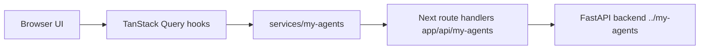

# my-agents-frontend

[한국어 README](./README.md)

Frontend companion for the `../my-agents` FastAPI + LangGraph backend.

This app is a polished AI service console built with Next.js 16, React 19, TypeScript, Tailwind CSS 4, TanStack Query, Zod, and Biome. It intentionally mirrors common GreetSchool/GreetAcademy service, model, query-key, keymesh component, and localization patterns so the project owner can follow and maintain the code manually.

## What this UI wires

- Auth: signup, email verification, login, password reset request/confirm, logout, current user restore.
- Product chat: conversations, server-owned messages, streamed assistant-answer conversation runs, run history, run events, citations, and a knowledge-base source selector (`All` or selected KBs only).
- Knowledge/document workflows: knowledge-base create/list/detail, KB-scoped document create/list/delete, PDF/Markdown/plain-text upload into a selected knowledge base, KB-scoped ingest, extraction runs, and document permission patch.
- Groups: create/list plus ID-based member role upsert/patch.

Product chat uses `/conversations/{id}/runs`; `/assistant/chat` is legacy/dev-only and is blocked from product BFF proxy use. Signup follows the hosted OpenAPI contract: account creation returns `{ user, verification_email_sent }`, then the user can log in with the same credentials after any required verification flow.

## Local setup

```bash
pnpm install
cp .env.example .env.local
pnpm dev
```

Run the backend separately, normally from `../my-agents`:

```bash
MY_AGENTS_RESPONSE_MODE=deterministic uv run uvicorn main:app --host 127.0.0.1 --port 8000
```

Required frontend environment variables are safe placeholders:

```bash
MY_AGENTS_BACKEND_URL=http://127.0.0.1:8000
MY_AGENTS_FRONTEND_ORIGIN=http://localhost:3000
MY_AGENTS_COOKIE_SECURE=false
```

Do not store real secrets in this repository or expose secrets with `NEXT_PUBLIC_*`.

## Localization rules

- Do not hardcode user-visible strings in components.
- The default locale is `ko` and is managed in `i18n.config.ts`.
- Add UI copy to both `localization/ko.json` and `localization/en.json`.
- In Client Components, use `useLocalization()` as in the Greet projects.
- In Server Components, metadata, and route handlers that need safe user-facing messages, use `defaultLocalization`.
- When removing or changing UI copy, remove unused localization keys in the same change.

Relevant files:

- `i18n.config.ts` — supported locales and default locale.
- `localization/*.json` — Korean and English UI copy.
- `utils/localization.ts` — dictionary accessor by locale.
- `providers/localization.tsx` — app-wide localization context.
- `hooks/useLocalization.ts` — Client Component localization hook.

## Design/theme workflow

`DESIGN.md` is the active design contract for UI, theme, spacing, typography, and component-state decisions. Read the relevant sections before UI work, and make sure new visual values map back to a `DESIGN.md` token or an explicit design note.

## Architecture



Important folders:

- `constants/` — API paths, query keys, headers, HTTP constants.
- `model/my-agents/` — Zod schemas and TypeScript types for backend contracts.
- `services/my-agents/` — typed service classes and safe API error handling.
- `server/my-agents/` — BFF configuration, cookie helpers, proxy allowlist, CSRF/same-origin policy.
- `hooks/` — TanStack Query hooks for auth, conversations, documents, knowledge, groups.
- `components/keymesh/` — app-specific UI helpers and product surfaces.
- `DESIGN.md` — active design contract for UI/theme/layout decisions.
- `docs/implementation-log.md` — followable implementation status and verification notes.
- `docs/backend-requests.md` — backend contract gaps discovered by frontend work.

## Agent handoff docs

Fresh Codex sessions should start with:

- `docs/agent-onboarding.md` — goals, current status, rules, and task workflow.
- `docs/frontend-architecture.md` — folder map, data flow, and endpoint coverage.
- `docs/security-and-backend-boundary.md` — BFF/CSRF model and backend read-only rules.
- `docs/verification-runbook.md` — local run commands, browser smoke, and final checks.
- `docs/public-demo-release-runbook.md` — preview/production gates, provider decision records, privacy copy, and evidence bundle template.

## Backend boundary

Frontend sessions may inspect `../my-agents` for contracts, schemas, and behavior, but must not edit backend files unless the user explicitly approves backend work. If a backend gap blocks a better frontend implementation, document it in `docs/backend-requests.md` first.

## Verification

```bash
pnpm lint
pnpm exec tsc --noEmit
pnpm exec vitest run
pnpm build
```

When backend/browser verification is needed, also run the backend and inspect the primary auth/chat journey in a browser.
