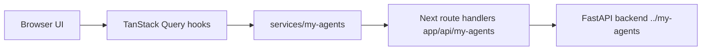

# my-agents-frontend

[한국어 README](./README.md)

The frontend paired with the `../my-agents` FastAPI + LangGraph backend.

An AI workspace built with Next.js 16, React 19, TypeScript, Tailwind CSS 4, TanStack Query, Zod, and Biome. The path a user walks is **upload documents → ask questions → check the evidence beside the answer**. Service, model, query-key, component, and copy conventions are written down in-repo so the work can be picked up by hand later.

Korean is the primary language. These screens were written in Korean rather than translated into it, so read [`docs/korean-copy-guide.md`](./docs/korean-copy-guide.md) before touching any string.

## What this UI wires

- **Auth** — signup, email verification, login, logout, password reset request and confirm, session restore after reload.
- **Guest access** — request a code and enter at `/guest`. Availability, code lifetime, usage limits, and delivery mode all come from the backend's `GET /auth/guest/policy` and are rendered from the served values; no limits are hardcoded in the UI.
- **Ask** — conversation list and transcript, server-owned messages, streamed answers, document-level sources, a live agent process retained on the latest answer, and knowledge-base selection.
- **Knowledge bases and documents** — create, list, rename, and delete personal and group knowledge bases; administrator-managed shared knowledge bases; upload PDF, Markdown, plain text, `.xlsx`, `.pptx`, and `.docx` by drag-and-drop or file picker into a selected knowledge base; add text directly; Markdown preview; retrieval-readiness and processing history.
- **Groups** — create and list groups, invitation-only membership, signup straight from an invitation link for people without an account, share-request review and status, and role management.
- **Settings** — account, theme, and experimental features.

## Rules this UI has to keep

These are the promises that break most easily when a screen is edited.

- Chat uses `/conversations/{id}/runs`. `/assistant/chat` is a legacy dev route and is blocked at the BFF proxy.
- Administrator-managed shared knowledge is attached to Ask automatically when configured. It is not a per-user memory and not a source the user toggles.
- Group membership is invitation-only. Never build UI implying user search, account-existence checks, or adding someone by `user_id`.
- Selecting a group knowledge base does not widen anything else: conversations and memory stay private to the user.
- Share requests start from a knowledge base or document action, not from the group screens, and users pick from a list rather than typing an ID.
- Invitees without an account set only a display name and password from the invitation link. They are not asked for their email again, and later sign-ins use the invited email, not the display name.
- Ordinary signup follows the backend's published OpenAPI contract: account creation returns `{ user, verification_email_sent }`, and the same credentials work after any required verification.
- Never show raw error messages, stack traces, session IDs, or CSRF tokens. User-facing error copy goes through `utils/error-message.ts`.

## Local setup

```bash
pnpm install
cp .env.example .env.local
pnpm dev
```

Run the backend separately, normally from `../my-agents`:

```bash
MY_AGENTS_RESPONSE_MODE=deterministic uv run uvicorn main:app --host 127.0.0.1 --port 8000
```

Every environment variable the frontend needs is safe to publish:

```bash
MY_AGENTS_BACKEND_URL=http://127.0.0.1:8000
MY_AGENTS_FRONTEND_ORIGIN=http://localhost:3000
MY_AGENTS_COOKIE_SECURE=false
```

Keep real secrets out of this repository, and never expose one through `NEXT_PUBLIC_*` — anything with that prefix is visible in the browser.

## Copy rules

- Do not hardcode user-visible strings in components.
- The default language is `ko`, managed in `i18n.config.ts`.
- Add copy to both `localization/ko.json` and `localization/en.json`; a test keeps their key shapes aligned.
- Use `useLocalization()` in Client Components.
- Use `defaultLocalization` in Server Components, metadata, and route handlers that need a safe user-facing message.
- When copy is removed or changed, clean up the keys it leaves behind in the same change.
- Never rename a Korean noun with a find-and-replace. Particles agree with the final consonant of the preceding syllable, so a bulk replace silently produces broken grammar.

Relevant files:

- `i18n.config.ts` — supported and default locales.
- `localization/*.json` — Korean and English copy.
- `utils/localization.ts` — dictionary accessor by locale.
- `providers/localization.tsx` — app-wide copy context.
- `hooks/useLocalization.ts` — Client Component hook.
- `docs/korean-copy-guide.md` — glossary, register, anti-patterns, canonical action labels.
- `tests/knowledge-copy.test.ts` — the mechanically checkable subset of those rules.

## Design and theme

`DESIGN.md` is the active contract for UI, theme, spacing, typography, and component states. Read the relevant section before UI work, and make sure any new visual value traces back to a token or an explicit decision there.

- Pretendard is self-hosted for Korean text, with its license, under `public/fonts/pretendard/`.
- Light and dark themes are both supported. The choice is stored in a cookie and applied before first paint so the page does not flash.
- `ServiceShell` owns scrolling. Do not recompute height with `calc(100dvh - …)` in individual screens; `DESIGN.md` records why.

For layout work, also apply the repo-local `responsive-design` skill: fit the narrow viewport first, prefer fluid type and spacing, check for horizontal overflow and comfortable touch targets, then refine wide screens.

## Architecture



The browser never calls the backend directly. Cookies, CSRF, and same-origin checks all need a server hop, so requests pass through Next route handlers that forward only allowlisted paths.

Important folders:

- `constants/` — API paths, query keys, headers, HTTP constants.
- `model/my-agents/` — Zod schemas and types validating backend contracts.
- `services/my-agents/` — typed service classes and safe API error handling.
- `server/my-agents/` — BFF configuration, cookie helpers, proxy allowlist, CSRF and same-origin policy.
- `hooks/` — TanStack Query hooks for auth, conversations, documents, knowledge bases, and groups.
- `components/` — product surfaces and screen-specific UI.
- `components/chat/` — the Ask workspace.
- `components/onboarding/` — first-run and guest tours, target registry, overlay runtime. Guest dismissal and completion live in sessionStorage; authenticated choices use an opaque localStorage bucket. This feature is the one place Zustand is used, as a thin client-state layer.
- `utils/error-message.ts` — the single place server errors become user-facing copy.
- `DESIGN.md` — the active UI, theme, and layout contract.
- `docs/implementation-log.md` — implementation sequence and verification notes.
- `docs/backend-requests.md` — backend contract gaps found during frontend work.

## Where a new agent should start

- `docs/agent-onboarding.md` — goals, current state, rules, workflow.
- `docs/frontend-architecture.md` — folder map, data flow, endpoint coverage.
- `docs/korean-copy-guide.md` — mandatory before touching copy.
- `docs/security-and-backend-boundary.md` — BFF/CSRF model and backend read-only rules.
- `docs/mobile-responsiveness.md` — responsive rules for screens and overlays.
- `docs/verification-runbook.md` — run commands, browser smoke, final checks.
- `docs/public-demo-release-runbook.md` — release gates and evidence template.

## Backend boundary

Reading `../my-agents` for contracts and behavior is fine. Editing it is not, unless the user explicitly approves backend work. Do not derive API models from backend source — use the OpenAPI document published by a running server. When a backend gap blocks better frontend work, record it in `docs/backend-requests.md` and report it.

## Verification

```bash
pnpm lint
pnpm exec tsc --noEmit
pnpm exec vitest run
pnpm exec playwright test
pnpm build
```

Playwright runs without a backend: most specs mock `**/api/my-agents/**` and the config starts the dev server itself. When a change genuinely needs the real backend, run it alongside and walk the login-to-answer path in a browser.
