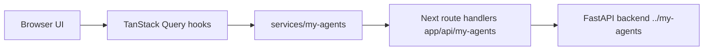

# my-agents-frontend

[English README](./README.en.md)

`../my-agents` FastAPI + LangGraph 백엔드를 위한 프론트엔드 companion 앱입니다.

이 앱은 Next.js 16, React 19, TypeScript, Tailwind CSS 4, TanStack Query, Zustand, Zod, Biome으로 만든 사용자용 AI 워크스페이스입니다. 핵심 여정은 지식 추가/관리 → 질문하기 → 답변 옆 인용 확인입니다. 프로젝트 소유자가 수동으로 따라가고 유지보수할 수 있도록 서비스, 모델, 쿼리 키, 앱 컴포넌트, localization 패턴을 프로젝트 내부 규칙으로 정리했습니다.

## 이 UI가 연결하는 기능

- 인증: 회원가입, 이메일 인증, 로그인, 비밀번호 재설정 요청/확정, 로그아웃, 현재 사용자 복원.
- Ask: 대화, 서버 소유 메시지, streamed assistant-answer conversation run, 답변 옆 citation, 상단 지식 선택, 접힌 응답 근거/작업 내역, 게스트 데모 사용 안내.
- 지식/소스 워크플로: 지식 공간 생성/목록, 선택한 지식 공간으로 PDF/Markdown/plain-text 드래그 앤 드롭 또는 파일 선택 업로드, 텍스트 소스 추가, 검색 준비/처리 내역.
- 팀: 생성/목록, 공유 지식 요청, 고급 섹션 안의 ID 기반 멤버/권한 관리.

Ask 화면은 `/conversations/{id}/runs`를 사용합니다. `/assistant/chat`은 레거시/개발용이므로 제품 BFF proxy에서 차단합니다. 회원가입은 hosted OpenAPI 계약을 그대로 따릅니다. 계정 생성은 `{ user, verification_email_sent }`를 반환하며, 사용자는 필요한 인증 흐름 이후 같은 자격 증명으로 로그인할 수 있습니다.

## 로컬 실행

```bash
pnpm install
cp .env.example .env.local
pnpm dev
```

백엔드는 보통 `../my-agents`에서 별도로 실행합니다.

```bash
MY_AGENTS_RESPONSE_MODE=deterministic uv run uvicorn main:app --host 127.0.0.1 --port 8000
```

필수 프론트엔드 환경 변수는 안전한 placeholder입니다.

```bash
MY_AGENTS_BACKEND_URL=http://127.0.0.1:8000
MY_AGENTS_FRONTEND_ORIGIN=http://localhost:3000
MY_AGENTS_COOKIE_SECURE=false
```

실제 secret을 이 저장소에 저장하거나 `NEXT_PUBLIC_*`로 노출하지 마세요.

## Localization 규칙

- 사용자에게 보이는 문자열은 컴포넌트에 하드코딩하지 않습니다.
- 기본 locale은 `ko`이며 `i18n.config.ts`에서 관리합니다.
- UI 문구는 `localization/ko.json`과 `localization/en.json`에 함께 추가합니다.
- Client Component에서는 `useLocalization()`을 사용합니다.
- Server Component, metadata, route handler의 안전한 사용자 메시지는 `defaultLocalization`을 사용합니다.
- 문구를 제거하거나 바꾸면 사용하지 않는 localization key도 같은 변경에서 정리합니다.

관련 파일:

- `i18n.config.ts` — 지원 locale과 기본 locale.
- `localization/*.json` — 한국어/영어 UI copy.
- `utils/localization.ts` — locale별 dictionary 접근자.
- `providers/localization.tsx` — 앱 전역 localization context.
- `hooks/useLocalization.ts` — Client Component용 localization hook.

## 디자인/테마 워크플로

`DESIGN.md`는 UI, theme, spacing, typography, component state를 결정할 때 읽어야 하는 활성 design contract입니다. UI 작업을 시작하기 전에 관련 섹션을 확인하고, 새 시각 값은 `DESIGN.md` token 또는 명시적인 design note로 되돌아갈 수 있어야 합니다.

UI/layout 변경은 repo-local `responsive-design` skill도 함께 적용합니다. 기본 순서는 mobile-first → fluid typography/spacing token 사용 → component-level container wrapper 검토 → horizontal overflow/touch target 점검 → desktop breakpoint 보강입니다.

## 아키텍처



주요 폴더:

- `constants/` — API path, query key, header, HTTP 상수.
- `model/my-agents/` — 백엔드 계약용 Zod schema와 TypeScript type.
- `services/my-agents/` — typed service class와 안전한 API error 처리.
- `server/my-agents/` — BFF 설정, cookie helper, proxy allowlist, CSRF/same-origin 정책.
- `hooks/` — auth, conversation, document, knowledge, group용 TanStack Query hook.
- `components/` — 앱 전용 UI helper와 제품 화면.
- `components/onboarding/` — 게스트/신규 사용자 안내 flow 정의, target registry, overlay runtime. 게스트 완료/건너뛰기는 sessionStorage, 로그인 사용자 결정은 opaque localStorage bucket에 저장합니다. 이 기능은 사용자 승인에 따라 Zustand를 얇은 클라이언트 상태/부분 persistence 계층으로 사용합니다.
- `DESIGN.md` — UI/theme/layout 결정을 위한 활성 design contract.
- `.agents/skills/responsive-design/SKILL.md` — UI/layout 변경 시 적용하는 responsive workflow.
- `docs/implementation-log.md` — 구현 상태와 검증 기록.
- `docs/backend-requests.md` — 프론트엔드 작업 중 발견한 백엔드 계약 gap.

## Agent handoff 문서

새 Codex 세션은 다음 문서부터 확인하세요.

- `docs/agent-onboarding.md` — 목표, 현재 상태, 규칙, 작업 흐름.
- `docs/frontend-architecture.md` — 폴더 맵, 데이터 흐름, 엔드포인트 커버리지.
- `docs/security-and-backend-boundary.md` — BFF/CSRF 모델과 백엔드 read-only 규칙.
- `docs/verification-runbook.md` — 로컬 실행 명령, 브라우저 smoke, 최종 확인.
- `docs/public-demo-release-runbook.md` — preview/production gate, provider decision record, privacy copy, evidence bundle template.

## 백엔드 경계

프론트엔드 세션은 계약, schema, 동작을 이해하기 위해 `../my-agents`를 읽을 수 있습니다. 하지만 사용자가 명시적으로 백엔드 작업을 승인하기 전에는 백엔드 파일을 수정하면 안 됩니다. 더 나은 프론트엔드 구현에 백엔드 gap이 막히면 먼저 `docs/backend-requests.md`에 기록하세요.

## 검증

```bash
pnpm lint
pnpm exec tsc --noEmit
pnpm exec vitest run
pnpm build
```

백엔드/브라우저 검증이 필요한 경우 백엔드를 함께 실행하고 주요 인증/채팅 흐름을 브라우저에서 확인하세요.
