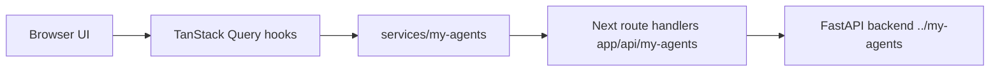

# my-agents-frontend

[English README](./README.en.md)

`../my-agents` FastAPI + LangGraph 백엔드와 짝이 되는 프론트엔드입니다.

Next.js 16, React 19, TypeScript, Tailwind CSS 4, TanStack Query, Zod, Biome으로 만든 AI 워크스페이스이고, 사용자가 지나가는 길은 **문서를 올리고 → 질문하고 → 답변 옆에 붙은 근거를 확인하는** 흐름입니다. 서비스, 모델, 쿼리 키, 컴포넌트, 문구 관리 방식을 저장소 안의 규칙으로 정리해 두어서 나중에 사람이 직접 이어서 손볼 수 있습니다.

기본 언어는 한국어입니다. 번역된 화면이 아니라 한국어를 기준으로 만든 화면이라, 문구를 건드리기 전에 [`docs/korean-copy-guide.md`](./docs/korean-copy-guide.md)를 먼저 읽어야 합니다.

## 이 UI가 연결하는 기능

- **인증** — 가입, 이메일 인증, 로그인, 로그아웃, 비밀번호 재설정 요청과 확정, 새로고침 후 로그인 상태 복원.
- **게스트 접속** — `/guest`에서 코드를 요청하고 입장합니다. 사용 가능 여부와 유효 시간, 사용 한도, 코드 전달 방식은 백엔드의 `GET /auth/guest/policy`가 알려 주는 값을 그대로 보여 줍니다. 화면에 숫자를 적어 두지 않습니다.
- **Ask** — 대화 목록과 대화 내용, 서버가 보관하는 메시지, 스트리밍 답변, 문서별 출처와 전체·부분 검토 범위, 최신 답변에 남는 검증된 답변 과정과 단계별 처리 요약, 그 안에 조용히 이어지는 AI 작성 진행 설명, 지식 베이스 선택, 관련 문서 후보와 제한된 파일명 단서 입력 및 마지막 전체 문서 목록 확인을 지원하는 V1/V2 확인 요청.
- **대화 첨부 파일** — 배포와 계정이 모두 허용할 때만 나타납니다. 이 대화에서만 쓰는 임시 파일을 골라 두었다가 질문을 보낼 때 함께 전송하고, 전송 전에 매번 동의를 받습니다. 지식 베이스에 저장되지 않고 일정 시간이 지나면 만료되며, 표에서 정한 형식만 편집한 파일을 내려받을 수 있습니다. 첨부할 수 있는 형식과 개수, 용량, 보관 방식은 모두 백엔드가 알려 주는 값을 그대로 씁니다.
- **지식 베이스와 문서** — 개인·그룹 지식 베이스를 만들고 목록을 보고 이름을 바꾸고 지우기, 관리자만 다루는 공통 지식 베이스, 선택한 지식 베이스로 PDF·Markdown·일반 텍스트와 `.xlsx`·`.pptx`·`.docx`를 끌어다 놓거나 골라서 올리기, 텍스트로 직접 추가하기, Markdown 미리보기, 검색 준비 상태와 처리 내역.
- **그룹** — 그룹 생성과 목록, 초대를 수락해야 맺어지는 멤버십, 계정이 없는 사람이 초대 링크에서 바로 가입하기, 공유 요청 검토와 진행 상태, 역할 관리.
- **설정** — 계정 정보, 화면 테마, 실험적인 기능.

## 이 UI가 지켜야 하는 규칙

화면을 고칠 때 깨지기 쉬운 약속들입니다.

- 대화는 `/conversations/{id}/runs`를 씁니다. `/assistant/chat`은 예전 개발용 경로라서 BFF 프록시에서 막아 두었습니다.
- 관리자가 등록한 공통 지식은 조건이 맞으면 Ask에 자동으로 붙습니다. 사용자가 켜고 끄는 개인·그룹 출처와는 다르고, 사용자별 메모리도 아닙니다.
- 그룹 멤버십은 초대로만 맺어집니다. 사용자를 검색하거나, 계정이 있는지 확인해 주거나, `user_id`를 직접 넣어 추가하는 것처럼 보이는 UI를 만들면 안 됩니다.
- 그룹 지식 베이스를 골라서 질문해도 대화와 메모리는 그 사용자만의 것으로 남습니다.
- 공유 요청은 그룹 화면이 아니라 지식 베이스와 문서의 동작에서 시작합니다. ID를 입력하는 대신 목록에서 고르게 합니다.
- 계정이 없는 초대 수신자는 초대 링크에서 표시 이름과 비밀번호만 정합니다. 이메일을 다시 묻지 않고, 나중에 로그인할 때는 표시 이름이 아니라 초대받은 이메일을 씁니다.
- 일반 가입은 백엔드가 게시한 OpenAPI 계약을 그대로 따릅니다. 계정을 만들면 `{ user, verification_email_sent }`가 오고, 필요한 인증을 마치면 같은 정보로 로그인합니다.
- 사용자에게 원본 오류 메시지, 스택 트레이스, 세션 ID, CSRF 토큰을 그대로 보여 주지 않습니다. 오류 문구는 `utils/error-message.ts`를 거칩니다.

## 로컬에서 실행하기

```bash
pnpm install
cp .env.example .env.local
pnpm dev
```

백엔드는 보통 `../my-agents`에서 따로 띄웁니다.

```bash
MY_AGENTS_RESPONSE_MODE=deterministic uv run uvicorn main:app --host 127.0.0.1 --port 8000
```

프론트엔드에 필요한 환경 변수는 전부 공개해도 되는 값입니다.

```bash
MY_AGENTS_BACKEND_URL=http://127.0.0.1:8000
MY_AGENTS_FRONTEND_ORIGIN=http://localhost:3000
MY_AGENTS_COOKIE_SECURE=false
```

실제 비밀 값은 이 저장소에 두지 말고, `NEXT_PUBLIC_*`으로도 내보내지 마세요. `NEXT_PUBLIC_`이 붙은 값은 브라우저에서 그대로 보입니다.

## 문구 관리 규칙

- 사용자에게 보이는 문자열을 컴포넌트에 직접 적지 않습니다.
- 기본 언어는 `ko`이고 `i18n.config.ts`에서 관리합니다.
- 문구는 `localization/ko.json`과 `localization/en.json`에 함께 추가합니다. 두 파일의 키 구조는 테스트로 맞춰 둡니다.
- Client Component에서는 `useLocalization()`을 씁니다.
- Server Component, metadata, route handler에서 안전한 메시지가 필요하면 `defaultLocalization`을 씁니다.
- 문구를 지우거나 바꾸면 쓰지 않게 된 키도 같은 변경에서 함께 정리합니다.
- 한국어 명사를 이름만 바꾸는 일괄 치환은 하지 마세요. 조사는 앞 글자의 받침에 따라 달라져서, 치환만 하면 `지식 베이스을` 같은 문장이 조용히 생깁니다.

관련 파일:

- `i18n.config.ts` — 지원 언어와 기본 언어.
- `localization/*.json` — 한국어·영어 문구.
- `utils/localization.ts` — 언어별 사전 접근자.
- `providers/localization.tsx` — 앱 전역 문구 컨텍스트.
- `hooks/useLocalization.ts` — Client Component용 훅.
- `docs/korean-copy-guide.md` — 용어, 말투, 피해야 할 표현, 버튼 문구 표.
- `tests/knowledge-copy.test.ts` — 위 규칙 중 기계로 검사할 수 있는 부분.

## 디자인과 테마

`DESIGN.md`가 UI, 테마, 여백, 타이포그래피, 컴포넌트 상태를 정하는 기준 문서입니다. UI 작업을 시작하기 전에 해당 부분을 읽고, 새로 쓰는 시각 값은 `DESIGN.md`의 토큰이나 명시적인 결정으로 되짚을 수 있어야 합니다.

- 한글 화면이므로 Pretendard를 직접 담아서 씁니다. `public/fonts/pretendard/`에 라이선스와 함께 들어 있습니다.
- 라이트·다크 두 테마를 모두 지원합니다. 선택 값은 쿠키에 저장하고 첫 페인트 전에 적용해서 화면이 번쩍이지 않게 합니다.
- 화면 스크롤은 `ServiceShell`이 소유합니다. 개별 화면에서 `calc(100dvh - …)`로 높이를 다시 계산하지 마세요. 이유는 `DESIGN.md`의 레이아웃 항목에 적어 두었습니다.

레이아웃을 바꿀 때는 저장소 안의 `responsive-design` 스킬도 함께 적용합니다. 좁은 화면을 먼저 맞추고, 유동적인 글자·여백 값을 쓰고, 가로 스크롤이 생기지 않는지와 손가락으로 누를 수 있는 크기인지 확인한 다음 넓은 화면을 다듬는 순서입니다.

## 아키텍처



브라우저는 백엔드를 직접 부르지 않습니다. 쿠키와 CSRF, 같은 출처 확인이 필요해서 Next의 route handler를 한 번 거치고, 그 계층이 허용된 경로만 백엔드로 넘깁니다.

주요 폴더:

- `constants/` — API 경로, 쿼리 키, 헤더, HTTP 상수.
- `model/my-agents/` — 백엔드 계약을 검사하는 Zod 스키마와 타입.
- `services/my-agents/` — 타입이 붙은 서비스 클래스와 안전한 오류 처리.
- `server/my-agents/` — BFF 설정, 쿠키 헬퍼, 허용 경로 목록, CSRF와 같은 출처 정책.
- `hooks/` — 인증, 대화, 문서, 지식 베이스, 그룹용 TanStack Query 훅.
- `components/` — 제품 화면과 화면 전용 UI 조각.
- `components/chat/` — Ask 화면을 이루는 컴포넌트.
- `components/onboarding/` — 처음 온 사용자와 게스트에게 보여 줄 안내 흐름, 대상 등록소, 오버레이 실행부. 게스트가 건너뛰거나 끝낸 기록은 sessionStorage에, 로그인 사용자의 선택은 내용을 알 수 없는 형태로 localStorage에 둡니다. 이 기능에 한해 Zustand를 얇은 클라이언트 상태 계층으로 씁니다.
- `utils/error-message.ts` — 서버 오류를 사용자에게 보여 줄 문구로 바꾸는 한 곳.
- `DESIGN.md` — UI와 테마, 레이아웃 결정 기준.
- `docs/implementation-log.md` — 구현 순서와 검증 기록.
- `docs/backend-requests.md` — 프론트엔드 작업에서 발견한 백엔드 계약의 빈 곳.

## 이어받는 에이전트가 먼저 읽을 문서

- `docs/agent-onboarding.md` — 목표, 현재 상태, 규칙, 작업 흐름.
- `docs/frontend-architecture.md` — 폴더 지도, 데이터 흐름, 엔드포인트 대응표.
- `docs/korean-copy-guide.md` — 문구를 건드린다면 반드시.
- `docs/security-and-backend-boundary.md` — BFF와 CSRF 모델, 백엔드 읽기 전용 규칙.
- `docs/mobile-responsiveness.md` — 화면과 오버레이의 반응형 규칙.
- `docs/verification-runbook.md` — 실행 명령, 브라우저 확인, 마무리 점검.
- `docs/public-demo-release-runbook.md` — 배포 전후 점검과 증적 정리 양식.

## 백엔드 경계

프론트엔드 작업 중에 계약과 동작을 이해하려고 `../my-agents`를 읽는 것은 괜찮습니다. 다만 사용자가 명시적으로 백엔드 작업을 승인하기 전에는 백엔드 파일을 고치지 않습니다. API 모델은 백엔드 소스를 보고 만들지 말고, 실행 중인 서버가 게시하는 OpenAPI 문서를 기준으로 삼습니다. 백엔드에 없는 것 때문에 프론트엔드가 막히면 먼저 `docs/backend-requests.md`에 적어 두고 알려 주세요.

## 검증

```bash
pnpm lint
pnpm exec tsc --noEmit
pnpm exec vitest run
pnpm exec playwright test
pnpm build
```

Playwright는 백엔드 없이 돌아갑니다. 대부분의 시나리오가 `**/api/my-agents/**` 응답을 대신 만들어 쓰고, 설정이 개발 서버를 알아서 띄웁니다. 실제 백엔드까지 붙여 확인해야 하는 변경이라면 백엔드를 함께 띄우고 로그인부터 질문까지 브라우저에서 직접 지나가 보세요.
