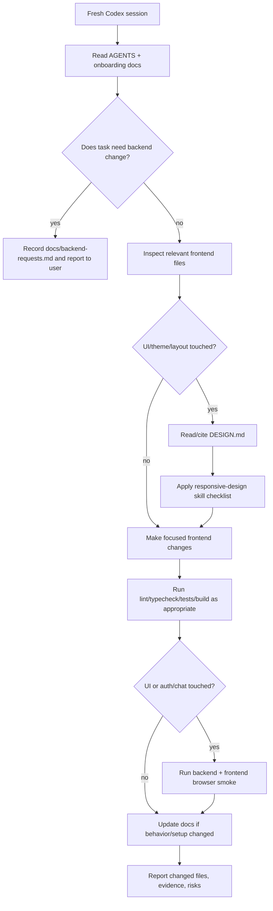

# Agent Onboarding Guide

Use this file first when a fresh Codex session starts in `my-agents-frontend`.

## Mission

`my-agents-frontend` is the frontend companion for the backend service in `../my-agents`. The product is a user-facing AI workspace where authenticated users can:

- sign up, log in, log out, and restore session state;
- add/manage knowledge sources;
- ask questions through product run endpoints;
- inspect citations beside answers and open work history only when needed;
- manage source spaces, groups, memberships, and source preparation/deletion through available backend contracts.

The frontend should remain understandable for manual maintenance. Its structure uses project-local conventions: top-level `constants/`, `model/`, `services/`, `server/`, `providers/`, `hooks/`, and app-specific `components/`.

## Current implementation status

The first full frontend queue has been implemented and verified:

- Project-local service/model/query foundation.
- Next BFF route handler at `app/api/my-agents/[...path]/route.ts`.
- Auth shell and protected service layout.
- Ask anchor journey using `/conversations/{id}/runs`, split into smaller chat UI components under `components/chat/`.
- Sources and Groups surfaces with raw ID/processing controls moved into Advanced disclosure where possible.
- Unit tests for path builders, query keys, BFF proxy policy, browser-safe auth response shape, and no-body mutation headers.

For chronological details, read `docs/implementation-log.md`.

## Read these files before changing code

1. `AGENTS.md` - project rules and backend boundary.
2. `DESIGN.md` - active design contract for UI/theme/layout decisions.
3. `.agents/skills/responsive-design/SKILL.md` - responsive layout workflow for UI changes.
4. `docs/frontend-architecture.md` - folder map and request/data flows.
5. `docs/security-and-backend-boundary.md` - BFF, CSRF, and cross-repo rules.
6. `docs/verification-runbook.md` - commands and browser smoke flow.
7. `docs/backend-requests.md` - backend gaps already discovered or requested.

If changing route handlers, cookies, headers, caching, server actions, or proxy behavior, also read the relevant local Next.js 16 docs under `node_modules/next/dist/docs/01-app/` before editing.

## Non-negotiable rules

- Do not edit `../my-agents` from a frontend task unless the user explicitly switches scope and approves backend work.
- Do not use `/assistant/chat` for product chat. Product chat uses `/conversations/{conversationId}/runs`.
- Do not store session cookies, CSRF values, raw passwords, or backend secrets in `localStorage` or `sessionStorage`.
- Do not expose `csrf_token` in browser-visible login responses.
- Do not turn the BFF into a permissive catch-all proxy. Keep method/path allowlisting explicit.
- Do not invent fake backend data. Use honest empty, disabled, TODO, or backend-request states.
- Do not improvise UI theme values when `DESIGN.md` already defines the design direction; update `DESIGN.md` first if the direction changes.
- Do not add another LLM/provider integration without explicit approval.
- Research and propose useful packages freely, but request direct user approval
  and wait before installing any new runtime or development package, including
  trial installs or package-downloading `npx`/`pnpm dlx` commands. Explain the
  package/version, benefit, alternatives, license and dependency/bundle impact.
  See "Adding UI/UX libraries" in `AGENTS.md` for the full approval policy.

## Common task workflow

## Recommended task sizes

Prefer small, reviewable slices:

- One endpoint family at a time.
- One UI surface at a time.
- One BFF/security behavior at a time, with regression tests.
- One documentation update per behavior/setup change.

For broad work, update `docs/implementation-log.md` as a living checklist while working.
