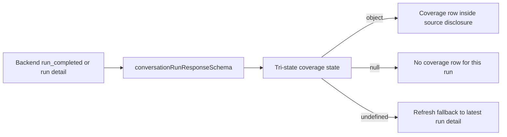

# Document coverage disclosure — work plan

**Branch:** `feature/document-coverage-disclosure`, cut from `develop` @ `98d3391`.
**Status:** implemented and locally verified on 2026-08-31.
**Written:** 2026-08-24.

This document exists because the working notes lived in `/tmp/agent-handoff/`,
which does not travel between machines. Everything needed to resume is here. No
external file is required.

---

## Contract verification — resolved

The backend PR branch was served locally and its live contract was read from
`http://127.0.0.1:8765/openapi.json` before the frontend model changed.

`AGENTS.md` forbids deriving frontend request/response models from backend
source inspection; API models come from the backend's hosted OpenAPI document.
The served schema confirmed an optional and nullable
`ConversationRunResponse.document_coverage`, with a strict
`DocumentCoverageResponse`: required `mode`, `document_id`, `title`,
`start_offset`, `end_offset`, and `total_chars`; optional nullable
`source_filename`; `complete | partial`; and nonnegative integer offsets. The
frontend Zod schema was written from that response rather than backend source.



---

## What this feature is

The backend can now answer a comprehensive question ("summarize this whole
contract") by reading a document end-to-end rather than retrieving matching
chunks. When it does, the run response carries `document_coverage` describing
what was actually read.

Two modes:

- `complete` — the whole document was read.
- `partial` — only a bounded leading range was read, because the document
  exceeded the read budget.

`document_coverage` is `null` on every ordinary, non-comprehensive answer. **A
null coverage field is the only signal distinguishing the two.** The old
`MY_AGENTS_FULL_DOCUMENT_RETRIEVAL_ENABLED` flag was removed in the reconciled
backend, so there is no flag to check and the mode must never be inferred from
anything else.

## Expected contract

`DocumentCoverageResponse`, on `ConversationRunResponse.document_coverage`.
**Confirm against hosted OpenAPI before use.**

| Field | Type |
|---|---|
| `mode` | `"complete" \| "partial"` |
| `document_id` | `str` |
| `title` | `str` |
| `source_filename` | `str \| None` |
| `start_offset` | `int ≥ 0` |
| `end_offset` | `int ≥ 0` |
| `total_chars` | `int ≥ 0` |

It is rebuilt after a refresh from stored run events, so it survives a reload
the same way a pending interaction does — a cold-load path already proven by
`e2e/durable-source-choice.spec.ts`.

No new backend field is needed for this UX.

---

## The UX

**One coverage row inside the existing evidence `<details>` surface.** Not a
banner, not a new panel, not a badge on the message bubble.

The answer already has an evidence affordance that asks "what is this based
on?". Coverage is the same question with a different shape of answer, so it
belongs in that slot and costs no new page real estate.

Copy, subject to `docs/korean-copy-guide.md`:

- **complete** → `문서 전체를 읽고 답했습니다 · {title}`
- **partial** → `문서 일부만 읽고 답했습니다 · {title} · 0–{end_offset}자 / 전체 {total_chars}자`

### Three rules that are easy to get wrong

**1. Coverage is not a citation, and must never be merged with one.** Coverage
says *what was read*. Citations say *what supported this specific claim*. A
full-document run does return citations, but they are overlapping-range
provenance rather than per-claim attribution — which is exactly why the range
needs its own honest label. Separate row, separate label, and coverage must not
be added into the evidence badge count.

**2. Partial is terminal. Do not imply more is reachable.** The backend has a
`full_document_next_cursor` internally but deliberately does not expose it, and
will not until multi-range synthesis exists. So: no "so far", no "yet", no
progress bar, no percentage, no affordance that reads as paginated. State what
was read and stop. Percentages are also dishonest here — a range can end
mid-sentence.

**3. Do not filter anything client-side.** System knowledge bases are already
excluded server-side in two places, and coverage can only ever name a personal
or group document. Adding a frontend filter would duplicate a check that is only
enforceable on the server and give false assurance it is enforced here. This is
the same invariant as `docs/durable-interactions.md` — "options are the
backend's list, never assembled here."

### Rejected alternatives, and why

- **A badge on the message bubble** — too prominent for something true of a
  minority of answers, and it competes with the reasoning and route chips.
- **A dedicated activity-timeline step** — coverage is a property of the answer,
  not a stage of the process. The activity panel already records
  `retrieval_completed`.

---

## A duplicate disclosure exists on purpose, for now

The backend currently **prepends a prose notice to the reply text itself** on
partial reads:

> `부분 검토 안내: 큰 문서의 0-{end}자만 검토했습니다(전체 {total}자). 아직 문서 전체 검토 결과는 아닙니다.`

So once this UI ships there will be **two** disclosures for one fact, briefly.
That is deliberate and is the safe direction to fail. The prose cannot be
removed first: until the frontend renders coverage, the prose is the *only*
disclosure, and removing it would make partial answers look complete.

**Ordering constraint — do not reorder:**

| # | Step | Owner |
|---|---|---|
| 1 | Land the backend merge, in-reply notice retained | backend |
| 2 | Host OpenAPI, share the URL | backend |
| 3 | **This branch:** parse coverage, render the evidence row | frontend |
| 4 | Confirm both disclosures coexist acceptably for one release | both |
| 5 | Remove the in-reply prose, or gate it for UI-less API consumers | backend |
| 6 | Fix its locale selection if any prose survives step 5 | backend |

Step 6 note: the notice picks its language by regex-detecting Hangul in the
*user's message*, not the app locale, so an English question in a Korean UI
yields an English notice. Independent of who owns the disclosure.

---

## Acceptance tests

**Unit**

1. `documentCoverageSchema` parses `complete` and `partial` from live OpenAPI
   fixtures, and rejects an unknown `mode` rather than defaulting to `partial`.
2. A run response with `document_coverage: null` renders exactly today's
   evidence surface — the ordinary non-comprehensive answer path.
3. `end_offset === total_chars` on a `partial` payload does not render as
   complete. The two are driven by `mode` alone.

**E2E**

4. Complete coverage → coverage row visible, names the document, rendered
   alongside whatever citations the run carries, and reads as range provenance
   rather than per-claim attribution.
5. Partial coverage → range rendered from the served integers; assert the Korean
   copy, not a bare number substring.
6. Coverage plus citations together → two distinct rows; the evidence count does
   not include coverage.
7. Reload during a completed full-document run → coverage rebuilt from run
   detail. Mirrors the existing cold-load case in
   `e2e/durable-source-choice.spec.ts`.
8. `document_coverage: null` parity → no coverage row; composer and evidence
   byte-identical to today.

**Copy**

9. `tests/localization.test.ts` keeps ko/en parity automatically. Add
   `JARGON_RULINGS` entries in `tests/knowledge-copy.test.ts` for any new noun.
   Watch particle agreement around the interpolated `{title}` — a title ending
   in a consonant takes a different particle than one ending in a vowel, so the
   copy must not place a particle directly after it.

---

## Implemented surface

- `model/my-agents/conversations.ts` parses the optional/nullable coverage
  object from every sync, SSE, replay, resume, and run-detail response path.
- `ChatWorkspace` keeps `undefined`, `null`, and object states distinct so an
  earlier run's coverage cannot reappear on a new ordinary answer.
- `EvidencePanel` renders coverage as its own row inside the source disclosure;
  it is not a source, citation, support badge, or count.
- `localization/{ko,en}.json` owns the complete/partial copy.
- Vitest covers schema and mode-authoritative formatting. Playwright covers
  complete, partial, ordinary/null, source-count parity, and narrow-width
  overflow.

No BFF or proxy work: coverage rides on run responses through routes that are
already allowlisted.

## Verification

```bash
pnpm lint && pnpm exec tsc --noEmit && pnpm exec vitest run
pnpm exec playwright test && pnpm build
```

The focused browser checks pass at 390px and 1280px. Full-suite verification is
recorded in `docs/implementation-log.md`.

---

## Unrelated open items, recorded so they are not lost with /tmp

Neither belongs to this branch.

- **Paged interaction options have never completed a live round trip.** A
  compound `interaction_id` such as `run-1:document_selection` is percent-encoded
  by the BFF (`:` → `%3A`) and it is unproven that the backend resolves it back
  when matching the path param. Both ends are unit-tested in
  `tests/proxy-policy.test.ts:178,208`; the middle hop is not. It only fires when
  a clarification exceeds one page, which the 2026-08-17 smoke did not.
  Comprehensive-document intent as the retrieval baseline makes that more likely,
  not less.
- **A second interrupt within one run** is handled in code but has never been
  exercised live.
