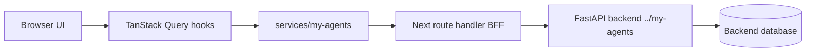
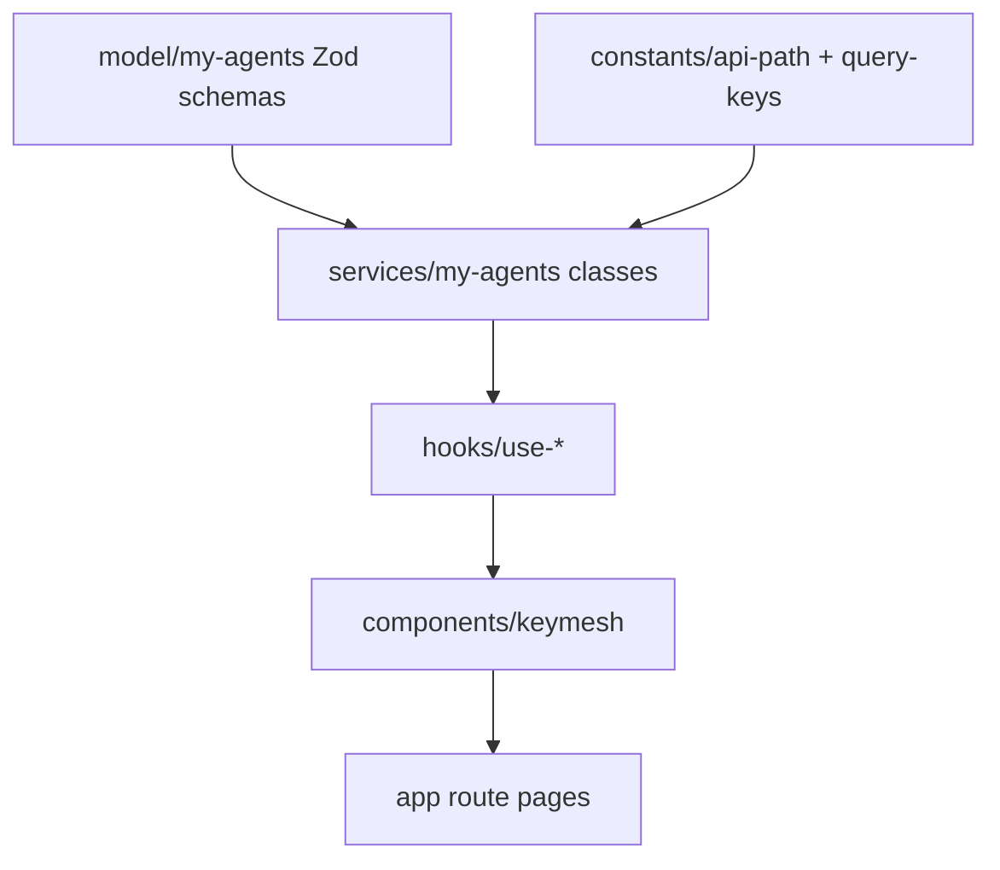

# Frontend Architecture

This document explains how the frontend is organized so future agents can work without rediscovering the design.

## High-level flow

Browser components do not call the FastAPI backend directly. They call same-origin frontend BFF routes through typed services. The BFF centralizes cookie forwarding, CSRF injection, allowlisting, and safe error behavior.

## Folder map

| Path | Purpose |
| --- | --- |
| `app/` | Next.js App Router pages, layouts, providers, and route handlers. |
| `app/api/my-agents/[...path]/route.ts` | Same-origin BFF for approved backend routes. |
| `components/ui/` | Generic shadcn/Base UI-style primitives. |
| `components/keymesh/` | App-specific product components and surfaces. |
| `constants/` | API paths, query keys, HTTP/header constants. |
| `model/my-agents/` | Zod schemas and inferred TypeScript types for backend contracts. |
| `services/my-agents/` | Typed service classes that call the BFF. |
| `server/my-agents/` | Server-only BFF config, cookies, and proxy policy. |
| `providers/` | Cross-app providers, currently TanStack Query. |
| `hooks/` | TanStack Query hooks for each product domain. |
| `tests/` | Vitest regression tests for contracts and BFF policy. |
| `docs/` | Handoff, architecture, runbook, backend requests, and implementation log. |
| `DESIGN.md` | Active design/theme contract for UI, layout, component states, and visual decisions. |
| `.agents/skills/responsive-design/SKILL.md` | Required responsive workflow for UI/layout changes. |
| `localization/` | Korean and English UI copy dictionaries; no user-visible component strings should be hardcoded. |

## Route groups and UI surfaces

| Route | Component | Notes |
| --- | --- | --- |
| `/` | `app/page.tsx` | Marketing/landing entry point. |
| `/login` | `components/keymesh/AuthPanel.tsx` | Login through BFF `/auth/login`. |
| `/signup` | `components/keymesh/AuthPanel.tsx` | Signup parses the backend `SignupResponse` envelope and shows an account-created handoff before login. |
| `/chat` | `components/keymesh/ChatWorkspace.tsx` | Anchor journey. Uses conversations, messages, streamed run answer deltas, events, citations. |
| `/documents` | `components/keymesh/AdminSurfaces.tsx` | Document create/list/delete, PDF upload, ingest, extraction runs, permission patch. |
| `/knowledge` | `components/keymesh/AdminSurfaces.tsx` | Knowledge-base create/list. |
| `/groups` | `components/keymesh/AdminSurfaces.tsx` | Group create/list and ID-based membership role actions. |

All service routes live under `app/(service)/layout.tsx`, which renders `ServiceShell` and restores auth through `/auth/me`.

## Data and typing layers

When adding or changing a backend-backed feature:

1. Add or update the Zod schema in `model/my-agents/`.
2. Add or update `constants/api-path.ts` and `constants/query-keys.ts`.
3. Add a method to the matching service class in `services/my-agents/`.
4. Add or update a TanStack Query hook in `hooks/`.
5. Build the UI in `components/keymesh/` and route page in `app/`.
6. Add tests for path/query/parser/security behavior when relevant.

## Endpoint coverage

The BFF allowlist currently covers:

- `GET /health`
- `POST /auth/signup`
- `POST /auth/verify-email`
- `POST /auth/login`
- `POST /auth/password-reset/request`
- `POST /auth/password-reset/confirm`
- `POST /auth/logout`
- `GET /auth/me`
- `POST /conversations`
- `GET /conversations`
- `GET /conversations/{conversation_id}`
- `POST /conversations/{conversation_id}/messages`
- `GET /conversations/{conversation_id}/messages`
- `POST /conversations/{conversation_id}/runs`
- `GET /conversations/{conversation_id}/runs`
- `POST /conversations/{conversation_id}/runs/stream`
- `GET /conversations/{conversation_id}/runs/{run_id}`
- `GET /conversations/{conversation_id}/runs/{run_id}/events`
- `POST /groups`
- `GET /groups`
- `GET /groups/{group_id}`
- `POST /groups/{group_id}/members`
- `PATCH /groups/{group_id}/members/{user_id}`
- `POST /knowledge-bases`
- `GET /knowledge-bases`
- `POST /documents`
- `POST /documents/upload`
- `GET /documents`
- `GET /documents/{document_id}`
- `DELETE /documents/{document_id}`
- `PATCH /documents/{document_id}/permissions`
- `POST /documents/{document_id}/ingest`
- `GET /documents/{document_id}/extraction-runs`

`POST /assistant/chat` is intentionally excluded from product BFF use. The Phase 2 upload route was reconciled from backend commit `ef88553` generated OpenAPI because the running local server still served the pre-Phase-2 OpenAPI; future model changes should prefer the hosted OpenAPI document once the backend server is restarted.

## Design approach

`DESIGN.md` is the active design/theme contract. UI work should treat it as the source of truth for brand personality, color, typography, spacing, radius, component states, accessibility, responsive behavior, and content voice.

Before changing UI/theme/layout code:

1. Read the relevant `DESIGN.md` sections.
2. Reuse existing `components/keymesh/` and `components/ui/` primitives first.
3. Apply `.agents/skills/responsive-design/SKILL.md`: mobile-first defaults, fluid type/spacing, container-query-ready reusable panels, overflow protection, and touch-target checks.
4. Map new visual values back to `DESIGN.md` tokens or add/update an explicit design note.
5. Keep user-visible strings in `localization/ko.json` and `localization/en.json`.
6. Record substantial visual workflow changes in `docs/implementation-log.md`.

The UI should stay polished but not noisy:

- Use readable spacing, generous body text, and clear empty/error/loading states.
- Keep chat as the primary product anchor surface.
- Keep admin surfaces honest and usable even when backend contracts are ID-based.
- Prefer `components/keymesh/` extraction over large route-page component trees.
