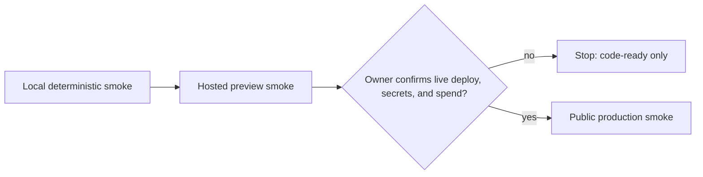

# Public Demo Release Runbook

This runbook is the operator checklist for moving the portfolio demo from local proof to preview proof and, only after explicit owner confirmation, public production proof. It intentionally avoids committing secrets, causing spend, or performing destructive production actions.

## Release gates



| Gate | Required proof | Stop condition |
| --- | --- | --- |
| Local | Backend, frontend, unit, type, build, and seeded browser smoke pass against local services. | Evidence bundle records commit SHAs and command outputs. |
| Preview | HTTPS frontend and backend preview URLs pass full visitor-account smoke without the dev outbox. | Preview evidence is complete before any production smoke. |
| Production | Final public smoke runs only after owner confirms live deploy, secrets, provider activation, and cost boundary. | Public evidence bundle is redacted and limitations are documented. |

Do not run production deployment, production migrations, provider activation, or paid API operations from an agent session without explicit owner confirmation.

## Provider/dependency decision record

Create one record for each email, database, hosting, analytics, monitoring, or UX dependency before enabling it:

```md
Provider/dependency:
Purpose / UX benefit:
Integration surface:
Package/API choice:
Env vars / secrets needed:
Free tier or cost ceiling:
Failure modes:
Fallback / rollback:
Offline test strategy:
Preview smoke evidence:
Production activation confirmation required: yes/no
Owner confirmation received: no
```

Evaluation rules:

- Prefer no new dependency unless it materially improves public visitor UX or deployment reliability.
- Keep secrets in provider dashboards or host environment variables only; never commit `.env`, screenshots with secrets, cookies, or API keys.
- Record cost ceilings before enabling anything that can bill. If the cost boundary is unclear, stop at preview-ready documentation.
- Include a rollback path such as disabling signup, returning to a seeded demo account, or turning off a provider webhook.

## Deployment topology matrix

Fill this table before preview smoke and refresh it before production smoke.

| Item | Local | Preview | Production |
| --- | --- | --- | --- |
| Frontend origin | `http://localhost:3000` | TBD HTTPS preview URL | Owner-confirmed public URL |
| Backend origin | `http://127.0.0.1:8000` or `http://localhost:8000` | TBD HTTPS API URL | Owner-confirmed public API URL |
| Database | Local SQLite or local Postgres | Persistent preview DB with migrations applied | Owner-confirmed persistent DB |
| Email/account provider | Local dev outbox only | Real provider or documented preview-safe verification path | Real provider; no dev outbox |
| OpenAI runtime | Deterministic or owner-provided key | Owner-approved env; redacted evidence | Owner-approved env and budget controls |
| Rollback | Stop local services | Disable signup or remove preview env | Disable signup or revert deployment |

## Auth/session matrix

| Environment | Cookie settings | CORS / origin | CSRF/session proof |
| --- | --- | --- | --- |
| Local | `MY_AGENTS_SESSION_COOKIE_SECURE=false`; SameSite `lax` unless backend contract differs. | Exact local frontend origin only. | Signup or seeded login -> `/auth/me` restore -> logout mutation succeeds. |
| Preview | Secure cookies; SameSite selected for deployed host topology. | Exact preview frontend origin configured in backend; wildcard CORS forbidden. | Browser smoke proves login, refresh restore, mutations, and logout on HTTPS preview. |
| Production | Secure cookies; production domain/proxy behavior verified. | Exact public frontend origin only. | Run only after owner confirmation and preview proof. |

Production config must assert `MY_AGENTS_AUTH_DEV_OUTBOX_ENABLED=false`; the public UI and evidence must not expose `/auth/dev/outbox`.

## Public visitor smoke checklist

The final visitor proof must exercise a real visitor account and fail loudly if required hosted/provider variables are absent.

1. Create a unique visitor account through the public UI.
2. Complete account verification through the configured provider flow, or record the preview-safe operator step if provider APIs require it.
3. Log in and refresh; `/auth/me` must restore the session.
4. Inspect browser `localStorage` and `sessionStorage`; they must not contain session cookies, CSRF tokens, provider tokens, raw passwords, or API keys.
5. Upload a supported text-based PDF, or create a text document if upload is explicitly out of scope for the gate.
6. Run ingest and record extraction evidence.
7. Create a conversation and run streamed chat.
8. Verify answer text, citations, and redacted activity events.
9. Refresh/reopen the conversation and verify persisted run/citation/event evidence.
10. Record screenshots or log snippets with email addresses, tokens, cookies, document contents, and host secrets redacted.


## Worker-3 coverage probe checklist

Use this checklist to close the verification/evidence lane before marking preview or public proof complete.

- Local backend proof is command-backed: `uv run pytest -q`, `uv run ruff check . --no-cache`, `uv run ruff format --check .`, and `uv run python -m scripts.local_demo_smoke --base-url http://localhost:8000 --timeout 120`.
- Local frontend proof is command-backed: `pnpm lint`, `pnpm exec tsc --noEmit`, `pnpm exec vitest run`, `pnpm build`, and the relevant Playwright smoke.
- Seeded local browser proof may use `V1_DEMO_EMAIL`/`V1_DEMO_PASSWORD`, but preview/public proof must set `V1_PUBLIC_VISITOR_SMOKE=1` and must use a unique visitor email template containing `{nonce}`.
- If `V1_PUBLIC_VISITOR_VERIFICATION_MODE=login-after-signup` is used, the evidence bundle must name the backend/provider rule that makes immediate login preview-safe; otherwise use `provider-command` and record the operator-safe activation mechanism.
- Hosted proof must record how Playwright reached the hosted frontend/backend topology, because the default `playwright.config.ts` web server targets local `http://localhost:3000` with `MY_AGENTS_BACKEND_URL=http://localhost:8000`.
- Public visitor proof must include either uploaded text-based PDF evidence or an explicit note that the text-document branch was intentionally used for that gate.
- `/assistant/chat` exclusion must be evidenced by `tests/proxy-policy.test.ts`; add a browser assertion only if the release gate requires end-to-end proof of the BFF rejection.
- Redacted event proof must state that only display-safe event names/payloads were captured and that screenshots/logs do not include prompts, provider exceptions, tokens, cookies, API keys, or raw backend internals.

## Privacy and demo-data copy

Use this public-facing limitation copy in launch notes, README handoff, or UI surfaces as appropriate:

> This is a portfolio demo. Do not upload secrets, credentials, medical/legal/financial records, or sensitive personal documents. Demo emails, uploaded documents, conversations, citations, and activity events may be retained until manual cleanup. Account deletion/export is not implemented yet; contact the operator for cleanup.

Operator cleanup path until self-service deletion exists:

1. Identify the redacted account alias or user id from the evidence bundle.
2. Remove the user's demo documents, conversations, events, sessions, verification/reset tokens, and account records through the backend's approved admin/database procedure.
3. Record cleanup timestamp without exposing raw document content or secrets.

## Evidence bundle template

Create one bundle per gate. Store it outside screenshots/log locations that may contain secrets, and redact before sharing.

```md
# Evidence bundle: local | preview | production

- Gate:
- Timestamp:
- Backend commit SHA:
- Frontend commit SHA:
- Frontend URL:
- Backend URL:
- Smoke account alias or redacted id:

## Backend checks

- `uv run pytest -q`: PASS/FAIL + output reference
- `uv run ruff check . --no-cache`: PASS/FAIL + output reference
- `uv run ruff format --check .`: PASS/FAIL + output reference
- `/health`: PASS/FAIL + output reference

## Frontend checks

- `pnpm lint`: PASS/FAIL + output reference
- `pnpm exec tsc --noEmit`: PASS/FAIL + output reference
- `pnpm exec vitest run`: PASS/FAIL + output reference
- `pnpm build`: PASS/FAIL + output reference
- `pnpm exec playwright test e2e/v1-demo.spec.ts`: PASS/FAIL + output reference
- Public visitor e2e mode/spec: PASS/FAIL + output reference

## Smoke checklist

- Signup/account verification:
- Login/session restore:
- Browser storage secret check:
- Document upload/create + ingest:
- Streamed chat:
- Citations:
- Redacted events:
- Refresh persistence:

## Provider/dependency decisions

- Provider records linked or pasted here:
- Cost/spend boundary:
- Rollback path:

## Redaction review

- Emails redacted:
- Cookies/tokens/API keys absent:
- Document contents redacted to safe snippets:
- Host logs/screenshots checked:

## Known limitations and remaining actions

- Preview must pass before production smoke:
- Owner-gated live deploy/secrets/spend actions:
- Follow-up risks:
```

## Command reference

Backend commands from `../my-agents`:

```bash
uv run pytest -q
uv run ruff check . --no-cache
uv run ruff format --check .
```

Frontend commands from this repo:

```bash
pnpm lint
pnpm exec tsc --noEmit
pnpm exec vitest run
pnpm build
pnpm exec playwright test e2e/v1-demo.spec.ts
```

Local seeded smoke may use `V1_DEMO_EMAIL` and `V1_DEMO_PASSWORD`. Public visitor smoke must not rely on a seeded account or dev outbox.
