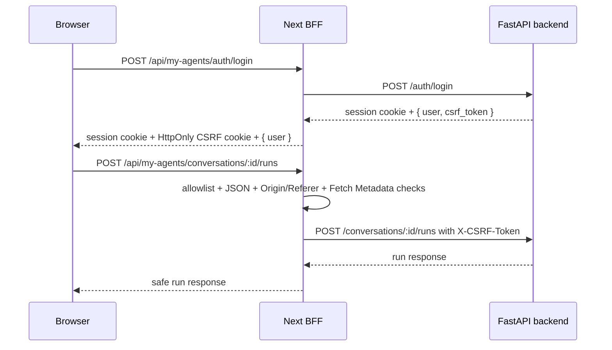

# Security and Backend Boundary

This project has two important boundaries: browser-to-frontend BFF security, and frontend-to-backend repository ownership.

## Backend repository boundary

`../my-agents` is the core backend service. Frontend Codex sessions may inspect it but must not modify it unless the user explicitly approves a backend-scoped task.

Allowed from this repo:

- Use the hosted backend OpenAPI document as the source of truth for frontend API contracts.
- Read backend route files, schemas, tests, and settings only when the task explicitly allows backend source inspection.
- Run read-only inspection commands when explicitly allowed and not substituting for hosted OpenAPI.
- Record backend gaps in `docs/backend-requests.md`.

Not allowed from this repo:

- Editing backend Python, Alembic, README, tests, or env files.
- Formatting backend files.
- Committing or pushing backend changes.
- Silently adding backend endpoints to unblock frontend UX.

Before final completion on any significant task, run:

```bash
git -C ../my-agents status --short
```

If it is dirty, distinguish user-existing changes from frontend-task side effects and do not modify backend files.

## BFF security model

The browser calls same-origin Next route handlers under `/api/my-agents/*`. The BFF forwards only allowlisted method/path pairs to the backend.



Important files:

- `app/api/my-agents/[...path]/route.ts` - route-handler BFF.
- `server/my-agents/proxy-policy.ts` - allowlist and same-origin checks.
- `server/my-agents/config.ts` - server-only BFF config.
- `server/my-agents/cookies.ts` - backend cookie parsing helpers.
- `services/my-agents/fetch-client.ts` - browser-facing same-origin fetch client.

## CSRF rules

Current strategy:

1. Backend login returns `csrf_token` in JSON and sets the backend session cookie.
2. The BFF uses the raw backend login body to set a same-origin HttpOnly auxiliary CSRF cookie.
3. The BFF removes `csrf_token` before returning login JSON to browser code.
4. Mutating browser calls go through the BFF.
5. The BFF injects the backend CSRF header server-side only after safety checks pass.

Unauthenticated auth lifecycle mutations (`/auth/signup`, `/auth/login`, `/auth/verify-email`, `/auth/password-reset/request`, and `/auth/password-reset/confirm`) are exempt from the CSRF-cookie requirement because a user may not have a session yet. They still go through same-origin JSON and fetch-metadata checks.

Never regress these rules:

- Browser-visible login response must not contain `csrf_token`.
- CSRF token must not be stored in `localStorage` or `sessionStorage`.
- No-body mutations such as logout and KB-scoped document ingest still need `Content-Type: application/json` so the BFF JSON mutation policy passes.
- Unknown paths, unsupported methods, and `/assistant/chat` product usage must not forward to the backend.
- Cross-site `Origin`, invalid `Referer`, and `Sec-Fetch-Site: cross-site` mutation attempts must be rejected before forwarding.
- The BFF may forward locale headers only from the safe allowlist:
  `Accept-Language`, `X-My-Agents-Language`, and `X-My-Agents-Locale`.
  If the UI later adds an explicit locale switcher, send `X-My-Agents-Language`
  from frontend requests so backend auth emails match the selected UI locale even
  when browser `Accept-Language` differs.

Regression tests that protect this:

- `tests/proxy-policy.test.ts`
- `tests/auth-model.test.ts`
- `tests/fetch-client.test.ts`


## Backend request policy

Use `docs/backend-requests.md` when a frontend task needs a backend capability that does not exist.

Create a backend request when:

- A durable frontend implementation is blocked by a missing route or field.
- A user experience is forced into an ID-only/manual workaround that should be solved by a backend contract.
- Session/CSRF recovery requires a backend-supported refresh endpoint or `/auth/me` field.

Do not create a backend request for:

- A temporary local-development issue.
- A frontend-only bug.
- A feature idea that the user has not asked to pursue.

## Public demo privacy and release boundary

For preview/production readiness, use [`public-demo-release-runbook.md`](./public-demo-release-runbook.md). The important safety boundaries are:

- Hosted preview smoke must pass before public production smoke.
- Agents must not run production deploys, production migrations, provider activation, or paid/spend-bearing operations without explicit owner confirmation.
- `GET /auth/dev/outbox` is local-only; production config must keep `MY_AGENTS_AUTH_DEV_OUTBOX_ENABLED=false`.
- Public evidence must redact emails, cookies, tokens, API keys, document contents beyond safe snippets, and host secrets.
- Demo visitors must be warned not to upload secrets, credentials, regulated records, or sensitive personal documents.
